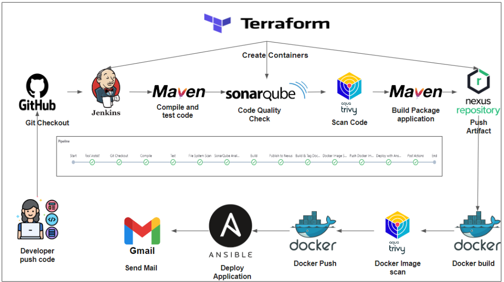

# CI/CD Pipeline for BoardGame Project

This project implements a comprehensive CI/CD pipeline using Jenkins to automate the build, test, analysis, packaging, and deployment of the `BoardGame` application. Below is a step-by-step explanation of the pipeline stages and their roles.

## Pipeline Steps

### 1. **Git Checkout**
   - Fetches the latest code from the `main` branch of the Git repository.
   - Ensures the pipeline starts with the most up-to-date source code.

### 2. **Compile**
   - Compiles the Java application using Maven.
   - Verifies that the source code is free of syntax errors and ready for testing.

### 3. **Test**
   - Executes unit tests using Maven to ensure the functionality and reliability of the code.

### 4. **File System Scan**
   - Scans the file system for security vulnerabilities using Trivy.
   - Generates a detailed vulnerability report in HTML format.

### 5. **SonarQube Analysis**
   - Conducts static code analysis to identify bugs, code smells, and vulnerabilities.
   - Enforces coding standards and ensures maintainable code.

### 6. **Build**
   - Packages the application into a deployable artifact (e.g., JAR file) using Maven.

### 7. **Publish to Nexus**
   - Uploads the build artifact to a Nexus repository for version management and sharing.

### 8. **Build & Tag Docker Image**
   - Creates a Docker image for the application and tags it with `latest`.

### 9. **Docker Image Scan**
   - Scans the Docker image with Trivy to detect vulnerabilities and generates a security report.

### 10. **Push Docker Image**
   - Pushes the Docker image to a container registry (Docker Hub) for deployment.

### 11. **Deploy with Ansible**
   - Deploys the application to the target environment using an Ansible playbook.
   - Ensures a reliable and automated deployment process.

## Infrastructure
- Jenkins, SonarQube, and Nexus are containerized and provisioned using Terraform, adhering to infrastructure-as-code (IaC) principles for scalability and consistency.

## Notifications
- After each pipeline run, a notification email is sent to inform the user of the build status and provide a link to the build logs.

## Technologies Used
- **Jenkins**: CI/CD automation.
- **Maven**: Build and dependency management.
- **Trivy**: Vulnerability scanning.
- **SonarQube**: Code quality and security analysis.
- **Docker**: Containerization.
- **Nexus**: Artifact repository management.
- **Ansible**: Deployment automation.
- **Terraform**: Infrastructure provisioning.

---
